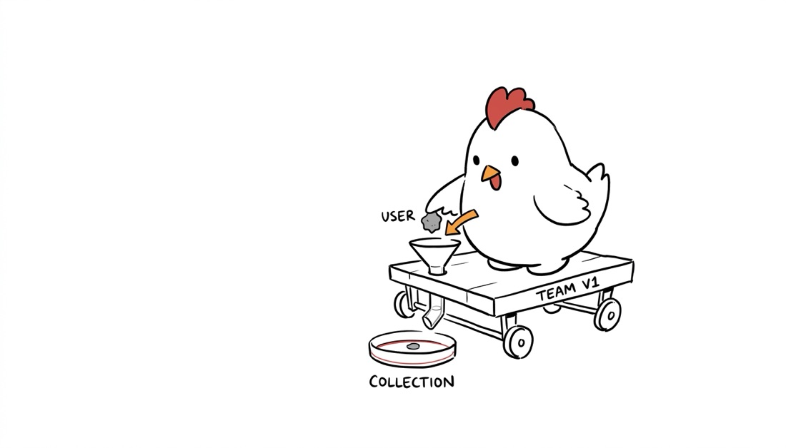
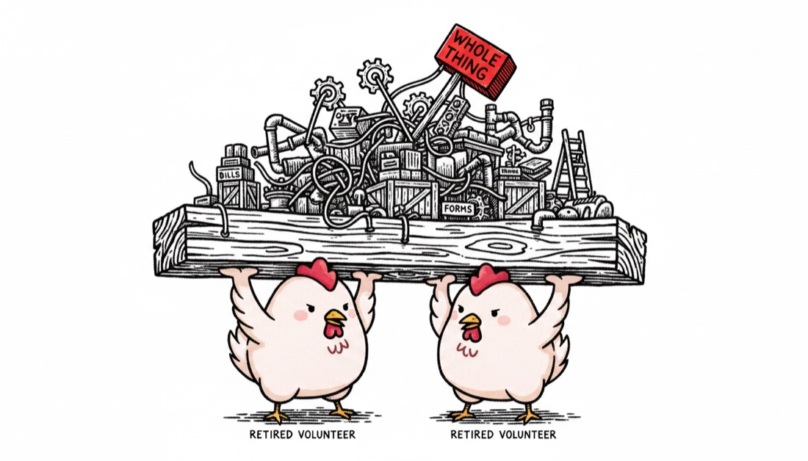

<div align="center">

# Nib

### Anyone can make one good AI illustration. Making the *10th* still look like **you** is the hard part.

Nib turns an idea — or a whole article — into original, white-background, hand-drawn
**editorial illustrations** that all star **one character you own**. One image, one idea.
The character *performs* the idea; it never just sits there. Because it's sent as the
reference on every generation, it stays on-model across an entire piece.

<p>
  
  
  
</p>

*Same character, three looks — and it didn't drift.*

**[nib.henryzh.dev](https://nib.henryzh.dev)** · Free & open source · MIT

</div>

---

## Install

Install the skill into your agent — one command, no app to download:

| Agent | Command |
| --- | --- |
| **Claude Code** | `npx skills add caezium/nib --skill nib` |
| **Codex CLI** | `codex plugin add caezium/nib` |
| **Cursor** | Add plugin: `caezium/nib` |
| **Gemini CLI** | `gemini extensions install caezium/nib` |

Then just ask:

```text
Use nib to illustrate: "small habits compound into a big result"
Use nib to make a 5-image set in riso for this article: https://paulgraham.com/ds.html
Use nib: set my avatar to ./avatar.png, then illustrate "saying no protects focus" in woodcut
```

## Two ways to pay: **free**, or pennies

- **Free — use your ChatGPT / Codex subscription.** If you're logged into the Codex CLI
  (`codex login`), Nib generates on your existing subscription. No API key, no per-image
  charge.
- **OpenRouter — a few cents an image.** Set `OPENROUTER_API_KEY` and Nib uses
  `google/gemini-2.5-flash-image` (or any image model via `--model`). Exact 16:9. A whole
  blog post for under a dollar.

It picks automatically: your OpenRouter key if set, else the free Codex lane.

## Bring a character — or grab one

Don't have a mascot? Use a **bundled character**:

```text
Use nib with the "blip" character to illustrate "ship small, ship often"
```

The [`skills/nib/characters/`](skills/nib/characters/) library ships ready-to-use
characters (and **PRs adding your own are welcome** — a character is just a folder with a
one-paragraph spec + a reference image). Or bring your own avatar image, and optionally
**describe it in words** (`--avatar-spec`) to lock its design even tighter.

## How it works

1. **A character** — your avatar image, a bundled pack, or a written description. It's the
   reference on every render, so it stays recognizable.
2. **An idea or an article.** A URL is fetched and reduced to clean text first. For an
   article, Nib picks the **load-bearing moments** (a judgment, a flow, a before/after, a
   trap, a loop) — 4–8 of them, not one image per paragraph.
3. **A fresh, concrete metaphor** in which the character performs the idea — pushes it,
   sorts it, steers it, builds it.
4. **Generate**, reviewing each against the quality bar (white background, one idea, the
   character performing the action, short labels only).

The methodology and the seven looks live in one place — `skills/nib/references/` — read by
**both** the skill engine and the desktop app, so they never drift.

## The seven looks

`marker` · `riso` · `blueprint` · `woodcut` · `pixel` · `clay` · `gouache` — one per piece,
so a set reads as a series. See [`references/styles.md`](skills/nib/references/styles.md).

## The engine

```sh
python3 skills/nib/scripts/generate.py \
  --idea "trust is built one piece of evidence at a time" \
  --style marker --avatar ./avatar.png --out out.png
```

Flags: `--backend auto|openrouter|codex` · `--model <id>` · `--avatar-pack <name>` ·
`--avatar-spec "<text>"`. Dependency-free (`python3` only).

## The desktop app

A TypeScript + React desktop app (macOS) — avatar onboarding, a style picker, generation
history, and a zoomable lightbox.

```sh
npm install && npm run gen   # first time
npm run dev                  # real generation (OpenAI or OpenRouter key)
npm run dev:mock             # placeholder images, no API calls
npm run build                # package the app
```

## Privacy & telemetry

The **desktop app** sends anonymous usage events (which mode/style, success/failure) and
crash reports — never your prompts, avatar, API keys, or images. Turn it off in
**Settings → Telemetry**. The **skill** sends no telemetry.

## Credits

Nib's house methodology is adapted from **[xiaohei (小黑)](https://github.com/helloianneo/ian-xiaohei-illustrations)**
by [helloianneo](https://github.com/helloianneo) — the hand-drawn editorial-illustration
skill that inspired this project. Nib reimplements its approach in its own words and code.

## License

MIT © 2026 Henry ([caezium](https://github.com/caezium)).
